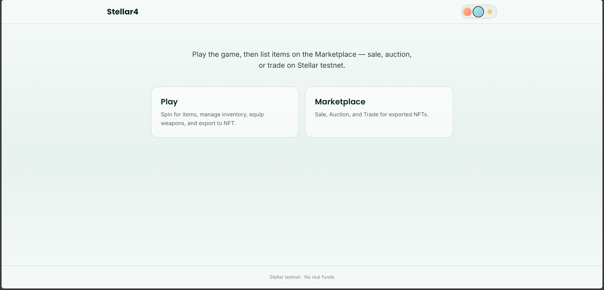
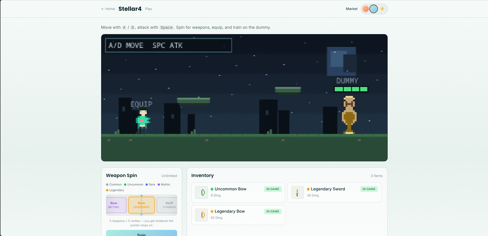
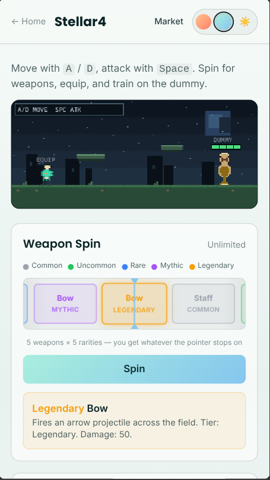
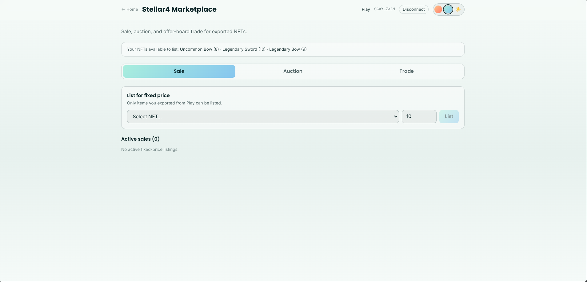
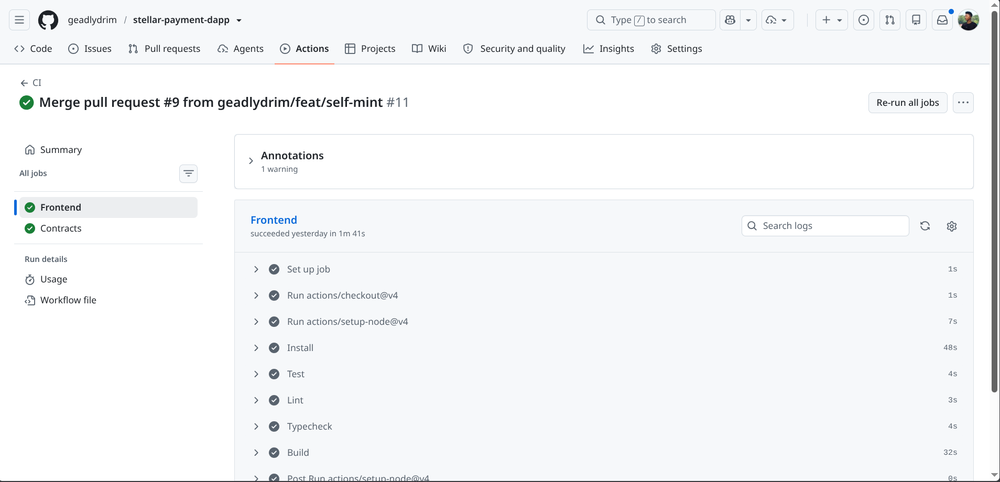
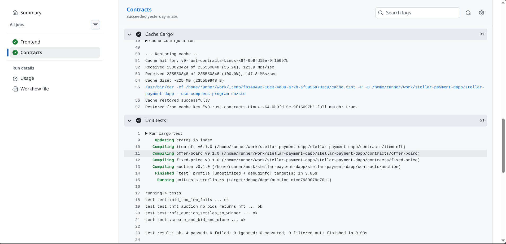

# Stellar4

Play **Stellar4**, then list items on **Stellar4 Marketplace** — fixed-price sale, NFT auction, or offer-board trade on Stellar testnet — without rewriting the game.

An item is either **usable in-game** or **tradable as an NFT**. Never both at once. Export from Play → list on Marketplace → settle → import back to Play.

[](https://stellar.org)
[](https://nextjs.org)
[](https://developers.stellar.org/docs/build/smart-contracts)
[](https://github.com/geadlydrim/stellar-payment-dapp/actions/workflows/ci.yml)


|                          |                                                                                                          |
| ------------------------ | -------------------------------------------------------------------------------------------------------- |
| **Repo**                 | [https://github.com/geadlydrim/stellar-payment-dapp](https://github.com/geadlydrim/stellar-payment-dapp) |
| **Live demo**            | [https://stellar-4.vercel.app/](https://stellar-4.vercel.app/)                                           |
| **Demo video (1–2 min)** | https://drive.google.com/file/d/17vIRrzb_72EZX4CXFypa-rbd0dSStZOy/view?usp=sharing                       |


## Screenshots

Landing



Play desktop



Play mobile



Marketplace



CI



Tests




## Surfaces


| Route     | Product                                                            |
| --------- | ------------------------------------------------------------------ |
| `/`       | Landing — choose Play or Marketplace                               |
| `/play`   | **Stellar4** — spin, inventory, equip / use, export / import       |
| `/market` | **Stellar4 Marketplace** — **Sale** · **Auction** · **Trade** tabs |


Players **self-mint** on export (`mint(signer, signer, item_id)`). A connected Freighter wallet does **not** need `set_minter`.

## What this dApp covers

Built as a production-shaped Stellar dApp: advanced Soroban contracts, inter-contract settlement, CI, tests, and a responsive frontend. The product also goes further (full game loop + three marketplace modes).


| Requirement                     | Where it lives                                                                                                                                                                                                 |
| ------------------------------- | -------------------------------------------------------------------------------------------------------------------------------------------------------------------------------------------------------------- |
| Advanced smart contracts        | Four Soroban crates: `item-nft` (mint / burn / transfer, player self-mint), `auction` (XLM escrow + NFT settle), `fixed-price`, `offer-board`                                                                  |
| Inter-contract communication    | Sale / auction / trade escrow the NFT, then call `item-nft.transfer` on settle. XLM uses the native SAC (`token::Client`)                                                                                      |
| Event streaming & live updates  | Contracts emit `item_nft` / `auction` / `sale` / `trade` topics. Marketplace reloads listings after each action; Auction tab polls `listActive` every 5s. Invokes are polled to SUCCESS/FAILED via Soroban RPC |
| CI/CD                           | GitHub Actions: frontend test → lint → typecheck → build; `cd contracts && cargo test`. [Workflow](https://github.com/geadlydrim/stellar-payment-dapp/actions/workflows/ci.yml)                                |
| Contract deployment workflow    | Ordered deploy in `[contracts/README.md](contracts/README.md)` and the table below. Testnet IDs are public `C…` addresses                                                                                      |
| Mobile-responsive frontend      | Tailwind `sm` / `lg` layouts on `/`, `/play`, and `/market`                                                                                                                                                    |
| Error handling & loading states | Wallet connect, listing, bid, offer, export/import. HostError / `#N` dumps are mapped to one-line player copy (`lib/user-error.ts`)                                                                            |
| Tests                           | Frontend `npm test` (**96** cases: registry, adapters, identity, errors). Contracts `cargo test` (**18** cases, including self-mint). Latest CI on `main` is green                                             |
| Production architecture         | Ports / adapters (`mock` vs `stellar`), Registry as inventory truth, Game has **no** Stellar SDK imports                                                                                                       |
| Docs & demo                     | This README + contract READMEs + live demo / video / screenshots (fill the blanks above)                                                                                                                       |


## Features (beyond that bar)

- **Stellar4 play** — spin for weapons / charms, canvas combat, inventory gated by `InGame`
- **Three market modes** — Sale (fixed XLM), Auction (escrow bids, close after `end_time`), Trade (offer board: XLM and/or other NFTs, explicit accept / reject)
- **Export / import** — lock → self-mint NFT → list; cancel or settle → burn / redeem back in-game
- **Session identity** — `/play` and Market listable inventory share the connected wallet (`G…`) on stellar, or a guest bag on mock
- **Buy / bid / offer** need a **second funded wallet**. There is no “demo buy” shortcut on-chain


## Architecture

```
Stellar4 /play ──► Registry (item + state) ◄── NftBridge (mint / burn)
                         │
                         ├── FixedPricePort  (Sale)
                         ├── AuctionPort     (Auction)
                         └── OfferBoardPort  (Trade)
                                      │
                         Stellar4 Marketplace /market
```


| Boundary                             | Must not                                            |
| ------------------------------------ | --------------------------------------------------- |
| Game (`lib/game`, `components/game`) | Import `@stellar/*`, `lib/soroban`, or `lib/wallet` |
| Registry                             | Know wallet UI or bid escrow                        |
| Marketplace UI                       | Bypass Registry `isListable` (`AsNft` + `tokenId`)  |
| Market contracts                     | Know combat `attrs`                                 |


Local default is **mock adapters** (no contract IDs required). Set `NEXT_PUBLIC_MARKET_ADAPTER=stellar` and all four `C…` IDs to use testnet.

## Getting started


### Prerequisites

- Node.js 18+ (20 recommended)
- Optional for on-chain work: [Rust](https://rustup.rs), [Stellar CLI](https://developers.stellar.org/docs/tools/cli), a funded testnet identity
- [Freighter](https://freighter.app) (or another Stellar Wallets Kit wallet) for Play and Marketplace


### Run locally

```bash
cp .env.example .env.local
# leave NEXT_PUBLIC_MARKET_ADAPTER=mock for game + marketplace without deploy IDs

npm install
npm run dev
```

Open [http://localhost:3000](http://localhost:3000), then Play or Marketplace.

To hit **testnet**, copy the contract IDs from the table below into `.env.local`, set `NEXT_PUBLIC_MARKET_ADAPTER=stellar`, and restart `npm run dev`.

### Tests

```bash
npm test                     # frontend unit tests (registry, adapters, identity, errors)
cd contracts && cargo test   # Soroban unit tests (18)
```

CI runs the same commands plus lint, typecheck, and `npm run build` — see `[.github/workflows/ci.yml](.github/workflows/ci.yml)`.

**CI screenshot:** [https://github.com/geadlydrim/stellar-payment-dapp/actions/runs/32851142457](https://github.com/geadlydrim/stellar-payment-dapp/actions/runs/32851142457) (green on `main` after self-mint merge).

### Get testnet XLM

1. Connect your wallet on `/play` or `/market`
2. Copy your address from the header
3. Fund it at [Stellar Laboratory Friendbot](https://laboratory.stellar.org/#account-creator?network=test)


## On-chain (Stellar testnet)

**Network:** testnet · **Native SAC:** `CDLZFC3SYJYDZT7K67VZ75HPJVIEUVNIXF47ZG2FB2RMQQVU2HHGCYSC`


| Contract        | ID                                                         | Explorer |
| --------------- | ---------------------------------------------------------- | -------- |
| **item-nft**    | `CBCAX5D4ZC4IZDKL3XTDH2A6TVKBXD2WE6ORBROIAYDKBWVCTDRFIONT` | [Lab](https://lab.stellar.org/r/testnet/contract/CBCAX5D4ZC4IZDKL3XTDH2A6TVKBXD2WE6ORBROIAYDKBWVCTDRFIONT) |
| **auction**     | `CDPJSUAOHRZ5L47X6TJWXEVAFLUHBWTGNR25KUK4Y3H6LXUZO7X6FYY6` | [Lab](https://lab.stellar.org/r/testnet/contract/CDPJSUAOHRZ5L47X6TJWXEVAFLUHBWTGNR25KUK4Y3H6LXUZO7X6FYY6) |
| **fixed-price** | `CDUDRNWCLAMLJBR5GHS4MJEYRE56P35UHFUG3PDFTUYVZKMLSMSSLIFF` | [Lab](https://lab.stellar.org/r/testnet/contract/CDUDRNWCLAMLJBR5GHS4MJEYRE56P35UHFUG3PDFTUYVZKMLSMSSLIFF) |
| **offer-board** | `CBBGU6YPB3RDIAC4VURJWNSYUMROEYI4IEXN4GMO7IUE6FQL4CYPQCFM` | [Lab](https://lab.stellar.org/r/testnet/contract/CBBGU6YPB3RDIAC4VURJWNSYUMROEYI4IEXN4GMO7IUE6FQL4CYPQCFM) |


**Example interaction (player self-mint, never** `set_minter`**'d):**


|                |          |
| -------------- | -------- |
| Tx hash        | `6d5c82a11f7adacfe70a5ad9e4ba745d0a08506b7939ff8e21a2366eddb22216` |
| Horizon        | [testnet tx](https://horizon-testnet.stellar.org/transactions/6d5c82a11f7adacfe70a5ad9e4ba745d0a08506b7939ff8e21a2366eddb22216) |
| Stellar Expert | [testnet tx](https://stellar.expert/explorer/testnet/tx/6d5c82a11f7adacfe70a5ad9e4ba745d0a08506b7939ff8e21a2366eddb22216) |
| Signer         | `GAMJHQP4L6XKIGBVJJ5RWP4KJVFKN4ZXOPNGFH7QKOIOJDE7P4IHO7WV` (`is_minter` false) |
| Result         | `mint(self, self, …)` → `token_id` 0 on the item-nft above |

| Interaction | Tx hash |
| ----------- | --------|
| List for Sale| [53e428724099266f81734f944035fc0c1804fe2cd8b94aa3893a97be07bc0758](https://stellar.expert/explorer/testnet/tx/18584804526178304#18584804526178305)|
| Buy| [11265112c4111fb98092df0b27a97867dd721693db236bed3dc905fd85d52a4c](https://stellar.expert/explorer/testnet/tx/18584959144964096#18584959144964097) |
| Create Auction| [6b810873988f3c4caa131c04c54de7a0896fb8eb109661a441f10a04a817251e](https://stellar.expert/explorer/testnet/tx/18584860360744960#18584860360744961) |
| Bid | [e25090617f50096af6b38829899beb8c2deb12aa5302f5aa6a0960acd7554049](https://stellar.expert/explorer/testnet/tx/18655078781083648#18655078781083649) |
| Close & Settle| [b05a79e5c9113671abc96f8a00e9b221364c076c5e56b38b6c28f8ff7e2589eb](https://stellar.expert/explorer/testnet/tx/18655203335127040#18655203335127041) |
| List for Offers | [a1376d24eef8f54ae37fc4e6ca1099029e247548a476eee7301a1f36934a8e06](https://stellar.expert/explorer/testnet/tx/18584881835556864#18584881835556865) |
| Accept offer| [c641b003d844a7913b99f3bb53642637caa58dd90bee4ab256bec6985f32cb03](https://stellar.expert/explorer/testnet/tx/18585083699019776#18585083699019777) |


## Deploy contracts (testnet)

**Order matters:** deploy and initialize `item-nft` **first**, then auction / fixed-price / offer-board (sale and trade bake `nft_contract` at `initialize`).

Players **self-mint**. Do **not** run `set_minter` for every Freighter wallet. `set_minter` is optional and only for mint-to-other / airdrop.

item-nft has **no upgrade** entrypoint. A new WASM is a new `C…`. Redeploy fixed-price and offer-board against that NFT id; auction can keep its ID (each listing passes `nft_contract`). Tokens on a previous item-nft `C…` are abandoned.


| Step | Crate               | Notes                          |
| ---- | ------------------- | ------------------------------ |
| 1    | `[contracts/item-nft](contracts/item-nft/README.md)`       | `initialize(admin)`. Players self-mint; optional `set_minter` only for mint-to-other / airdrop |
| 2    | `[contracts/auction](contracts/auction/README.md)`         | NFT settle WASM — do not reuse an old XLM-only auction ID for Marketplace Auction              |
| 3    | `[contracts/fixed-price](contracts/fixed-price/README.md)` | `initialize` with native SAC + **current** `item-nft` id                                       |
| 4    | `[contracts/offer-board](contracts/offer-board/README.md)` | Same: native SAC + **current** `item-nft` id                                                   |


Workspace overview, env placeholders, and event topics: `[contracts/README.md](contracts/README.md)`.

## Tech stack


| Technology              | Purpose                                     |
| ----------------------- | ------------------------------------------- |
| Next.js 14 (App Router) | React frontend                              |
| TypeScript              | Type safety                                 |
| Tailwind CSS            | Responsive styling                          |
| `@stellar/stellar-sdk`  | Horizon + Soroban RPC                       |
| Stellar Wallets Kit     | Multi-wallet signing                        |
| Soroban (Rust)          | item-nft, auction, fixed-price, offer-board |
| GitHub Actions          | CI: frontend + `cargo test`                 |


## Project structure

```
stellar-payment-dapp/
├── app/play/                 # Stellar4 game
├── app/market/               # Stellar4 Marketplace
├── app/page.tsx              # Landing (Play vs Market)
├── components/game/          # Play / inventory UI (no Stellar imports)
├── components/market/        # Sale / Auction / Trade
├── lib/
│   ├── game/                 # Game services (no Stellar)
│   ├── registry/             # Item store + state machine
│   ├── ports/                # NftBridge + market ports
│   ├── adapters/             # mock + stellar
│   └── user-error.ts         # Player-facing error mapping
├── contracts/                # Soroban workspace
├── docs/screenshots/         # Submission screenshots (add files here)
└── .github/workflows/ci.yml  # Frontend + contract tests
```

---

Built on Stellar testnet. No real funds involved.
